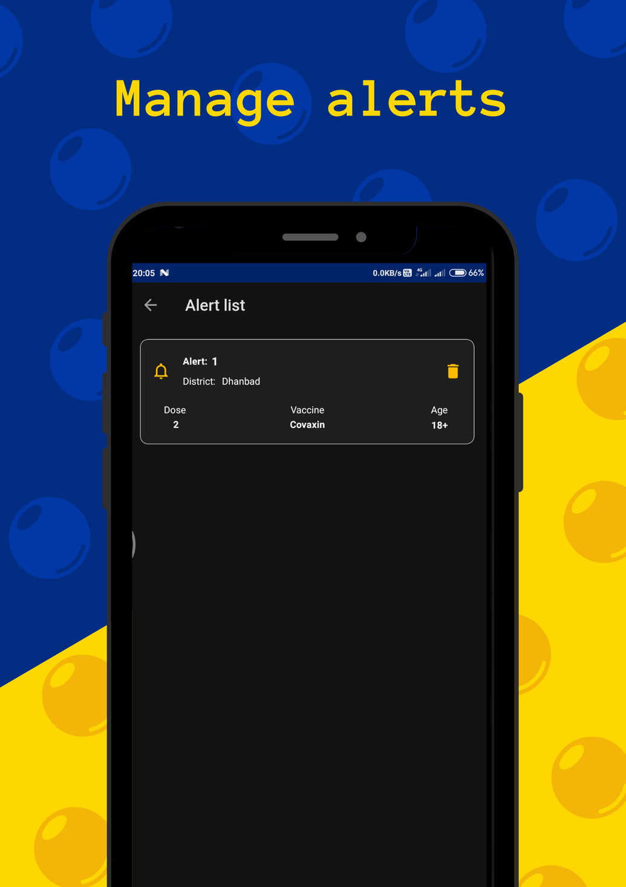

# 💉 GetVaccinated

An Android application to check and subscribe for slots availability of vaccines used in India.

The data we provide is fetched from public APIs of [CoWIN](https://apisetu.gov.in/public/api/cowin/cowin-public-v2#/)

## ✨ Features
- [x] Check slots availability with an ease.
- [x] Subscribe for alerts to get real time notification when slots are available.
- [x] Unsubscribe from alerts anytime.

## 📸 Screenshots
Home                        |  Set alerts                 |  Manage alerts    
:-------------------------: | :-------------------------: | :-------------------------: 
 |  | 

Slots                        |  Book slot using Co-WIN                     
:-------------------------:  | :-------------------------: 
 | 

## 🤓 Author
**Pawan Kumar Gorai** 

> Feel free to star ⭐ this repository if you like what you see 😉.

